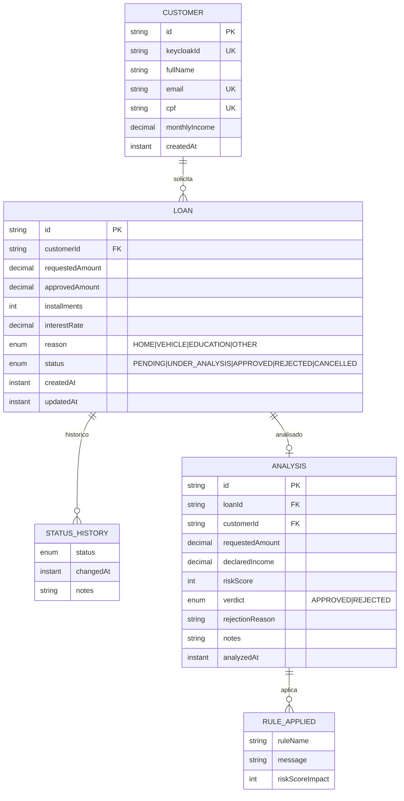

# Petrifica - Ecossistema de Empréstimos & Prevenção de Fraude

Projeto robusto de microserviços desenhado com os princípios de **Clean Architecture** e **Clean Code**, utilizando processamento assíncrono e arquitetura baseada em eventos para um ciclo de vida de crédito 100% automatizado.

## 🏛️ Arquitetura Estratégica

O sistema é composto por microserviços independentes que colaboram via **Kafka**, garantindo alta disponibilidade e resiliência:

- **Loan Service**: Core de negócio. Gerencia Clientes, Solicitações de Empréstimo e o Ciclo de Vida do crédito (Status Machine).
- **Fraud Analysis Service**: Motor de regras de risco. Analisa comportamentos, valores e histórico para decidir o veredito de aprovação.
- **Keycloak**: Segurança centralizada com OAuth2 e JWT.
- **Event-Driven Architecture**: Comunicação via tópicos `loan-requested` e `fraud-analyzed`.

## 📁 Estrutura de Pastas (Clean Layers)

Ambos os serviços seguem uma estrutura padronizada de camadas:

```text
Petrifica/
|- loan-service/
|  |- controller/   # Interface REST (DTOs, Mappers, Controllers)
|  |- service/      # Regras de Negócio e Casos de Uso
|  |- entity/       # Modelagem de Dados (MongoDB Documents)
|  |- repository/   # Persistência de Dados
|  |- messaging/    # Producers e Consumers Kafka
|  |- config/       # Configurações Spring (Security, Kafka, Beans)
|  |- exception/    # Tratamento Global de Erros (Problem Details)
```

## Arquitetura de Eventos

```text
POST /loans (loan-service)
  -> publica LoanRequestedEvent em loan-topic
  -> fraud-analysis-service consome loan-topic
  -> calcula score e salva Analysis
  -> publica FraudAnalysisResultEvent em fraud-topic
  -> loan-service consome fraud-topic
  -> aplica transicao APPROVE/REJECT e persiste historico
```

## ⚙️ Tecnologias de Ponta

- **Backend**: Java 17, Spring Boot 3.4, Spring Security (OAuth2), Spring Kafka.
- **Banco de Dados**: MongoDB (Persistência NoSQL flexível).
- **Mensageria**: Apache Kafka (Desacoplamento e Escala).
- **IAM**: Keycloak (Gerenciamento de Identidade e Acesso).
- **Padronização**: Lombok, MapStruct (implícito), OpenAPI/Swagger.

## Modelagem de Dados



## Regras de Risco Implementadas

No `FraudAnalysisService.analyzeLoan(...)`:

1. Valor solicitado > 50% da renda mensal: `+30`
2. Valor solicitado > `50000`: `+40`
3. Cliente com mais de 1 analise aprovada no historico: `+25`
4. Parcelas > `48`: `+20`

Veredito:
- `score < 50` -> `APPROVED`
- `score >= 50` -> `REJECTED`

## Endpoints Principais

### loan-service (`http://localhost:8081`)

- `POST /customers`
- `POST /loans`
- `GET /loans/{id}`
- `PUT /loans/{id}`
- `DELETE /loans/{id}`
- `GET /loans/me`
- `GET /loans/pending` (role `ANALYST`)

### fraud-analysis-service (`http://localhost:8082`)

- `GET /frauds/loans/{loanId}`
- `GET /frauds/customers/{customerId}`
- `GET /frauds/stats`

## 🚀 Como Executar

O projeto já está pronto para rodar com **Docker Compose**.

### 1) Build dos serviços

```bash
mvn clean package -DskipTests
```

### 2) Subir infraestrutura

```bash
docker compose up -d --build
```

### 3) Monitoramento

- **Swagger UI**: `http://localhost:8081/swagger-ui.html`
- **Keycloak Console**: `http://localhost:8080` (admin/admin)
- **MongoDB**: `localhost:27017`

## Validacao Rapida do Fluxo

```bash
TOKEN=$(curl -s -X POST http://localhost:8080/realms/petrifica/protocol/openid-connect/token \
  -d "grant_type=password" \
  -d "client_id=petrifica-client" \
  -d "username=joao" \
  -d "password=123456" | jq -r '.access_token')

curl -s -X POST http://localhost:8081/customers \
  -H "Authorization: Bearer $TOKEN" \
  -H "Content-Type: application/json" \
  -d '{"fullName":"Joao Silva","email":"joao@email.com","cpf":"12345678900","monthlyIncome":10000}'

LOAN_ID=$(curl -s -X POST http://localhost:8081/loans \
  -H "Authorization: Bearer $TOKEN" \
  -H "Content-Type: application/json" \
  -d '{"requestedAmount":3000,"installments":12,"reason":"HOME"}' | jq -r '.id')

sleep 3

curl -s -H "Authorization: Bearer $TOKEN" http://localhost:8081/loans/$LOAN_ID | jq '.status'
```

## Observacoes Operacionais

- No Docker, os servicos usam `kafka:29092` internamente e `localhost:9092` externamente.
- Para JWT no container, use configuracao de `issuer-uri` e/ou `jwk-set-uri` coerente com o host acessivel pelo servico.
- Migracoes Mongock sao executadas na inicializacao dos serviços.
